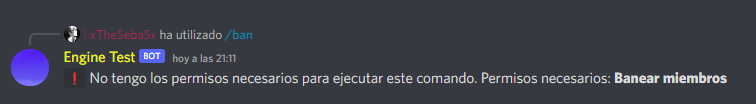
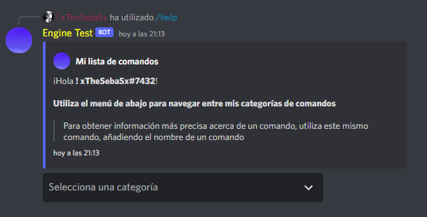

# Detalles de la versión 2.3.0

¡Hola!

Después de mucho tiempo, nos complace anunciar nuestra nueva versión para nuestro bot **[Engine](https://discord.com/oauth2/authorize?client_id=810920092480176198&scope=bot%20applications.commands&permissions=8)**

En esta actualización traemos:
    - Cambios en los permisos de los comandos
    - Nuevos comandos
    - Rediseño de comandos
    - Nuevas funciones
    - Y más!

## Cambios en los permisos de los comandos

Discord hace relativamente poco (A fecha de este lanzamiento), presentó un nuevo sistema para manejar los permisos de los comandos de barra (/), así que hemos decidido implementar esta nueva "función" a nuestro bot... Básicamente los comandos dejarán de requerir permisos para ser ejecutados, a que nos referimos.

Con esta nueva función que Discord ha implementado, vemos innecesario el uso de permisos para los comandos de barra, así que hemos eliminado esto, igualmente, estaremos viendo alguna forma de que esto sea configurable.

Si quieren que los comandos requieran de permisos, o no.

> ¡¡Igualmente, **Engine** va a requerir permisos para poder usar los comandos!!

## Nuevos comandos

Esta actualización está lleno de muchos cambios, entre ellos **nuevos comandos**:

- userinfo
    > Muestra información sobre un usuario

- say
    > Hace que el bot diga algo

- command
    > Bloquea, o desbloquea el uso de un comando para todos tus usuarios (Menos administradores)

- deltimeout
    > Elimina un timeout de un usuario

- embedsay
    > Hace que el bot diga algo con un embed

## Rediseño de comandos

Nuestro propósito con este cambio ha sido darle un diseño simple, agradable, y entendible al momento de usar los comandos

Este cambio será afectado para mensajes de "error", o cuando hace falta de algún argumento:

Y para los comandos que muestren bastante información, decidimos ya darle un diseño "avanzado", pero a la vez simple:

También hemos cambiado el uso de algunos comandos, haciéndolos más complejos:

- clear
    > Ahora podrás eliminar mensajes que tengan alguna palabra en el contenido, también mensajes de un usuario en específico, y podrás eliminar mensajes de otros canales

- snipe
    > Se agregó 2 nuevos subcomandos, uno para ver los mensajes eliminados y otro para ver el último mensaje editado

## Nuevas funciones

Hemos estado trabajando durante meses con estos nuevos sistemas que sabemos que muchos utilizarán:

### - Sorteos
### - Registros (Desarrollo)
### - Bienvenidas, despedidas (Desarrollo)

## Sistema de sorteos

Este sistema trae consigo **4** nuevos comandos:

    - sorteo
        > Crea un sorteo
    
    - stop
        > Pausa un sorteo

    - end
        > Finaliza un sorteo

    - reroll
        > Re-lanza un sorteo

## Sistemas de registros

(En desarrollo) Este comando trabajará junto al comando **snipe**, esto quiere decir que debe haber al menos un registro de mensajes para poder funcionar.

## Sistema de bienvenidas y despedidas

(En desarrollo) Gracias a que Discord nos dió acceso a el intent de **Guild Member**, y debemos hacer algo con este intent, hemos decidido implementar un sistema de bienvenidas y despedidas.

Este sistema de bienvenidas incluirá:

- Mensajes de bienvenida en texto
- Mensajes de bienvenida en embed
- Agregar roles a tus nuevos usuarios, o bots
- Enviarles un mensaje por privado al usuario que haya entrado a tu servidor
- Enviarles un mensaje por privado al usuario que haya salido de tu servidor
- Mensajes de despedida en texto
- Mensajes de despedida en embed
---

Estamos muy emocionados de presentar esta nueva actualización, junto a las nuevas funciones, comandos, y demás.

Queremos agradecer a todos los usuarios y servidores que han confiado en nosotros, y por darnos los **242** servidores

Seguiremos en contacto con muchas más novedades en nuestro bot, y dándoles la oportunidad de que nos ayuden a mejorarlo.